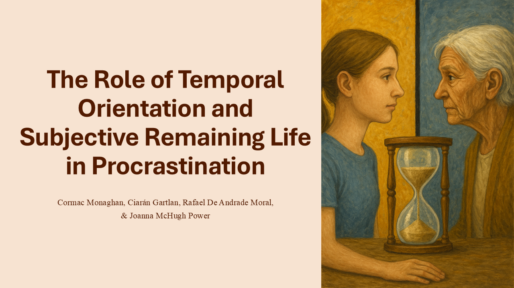

<!-- README.md is generated from README.qmd. Please edit that file -->

## Why is this not a quarto presentation

I had initially given this talk at one of our smaller seminar series in
my department back in 2024. This was before I started primary using
[Quarto](https://quarto.org/) and [RevealJS](https://revealjs.com/) to
design my slides.

I quite liked the design of my slides from back then and did not have
enough creative inspiration to recreate the same story telling design
for them in Quarto. I had initially thought of using the [animate
package](https://github.com/fradav/quarto-revealjs-animate) to create
the same animations that I had in PowerPoint the slides. However, the
syntax for such animations was too difficult for me to learn in such a
short time frame and I did not know enough about the back-end of SVG
files to correctly implement it.

With that in mind, while I have continuously worked to move away from
Office products (like PowerPoint), I decided to keep this presentation
in its [original
format](https://github.com/C-Monaghan/talks/blob/main/2025-07-11-PRC/slides.pdf).

