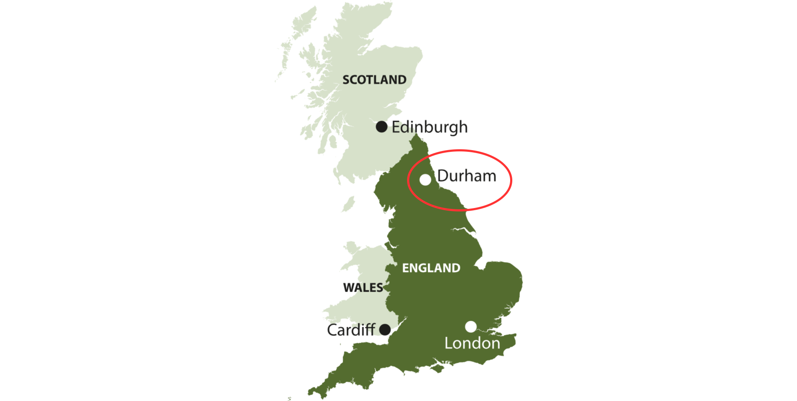
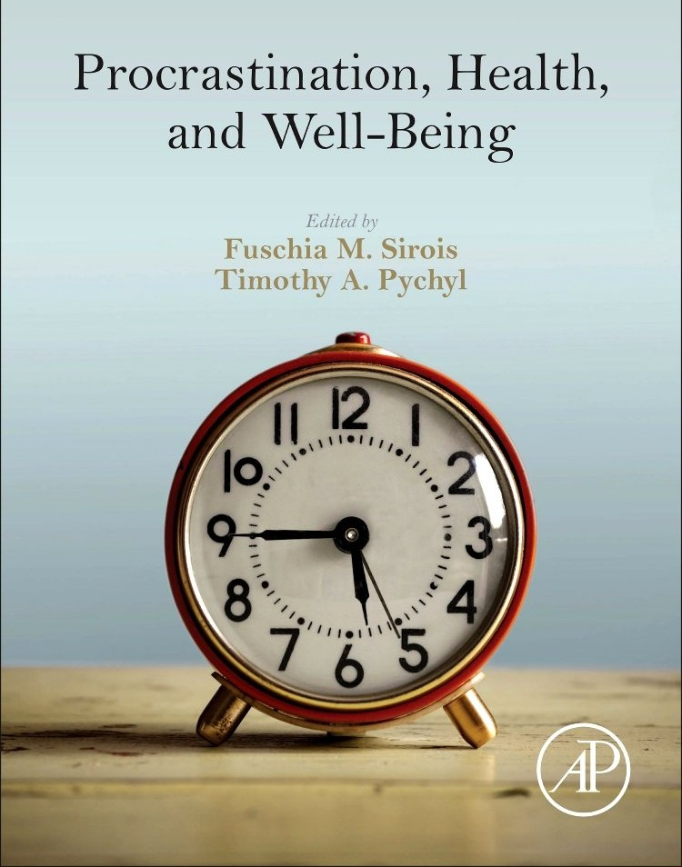
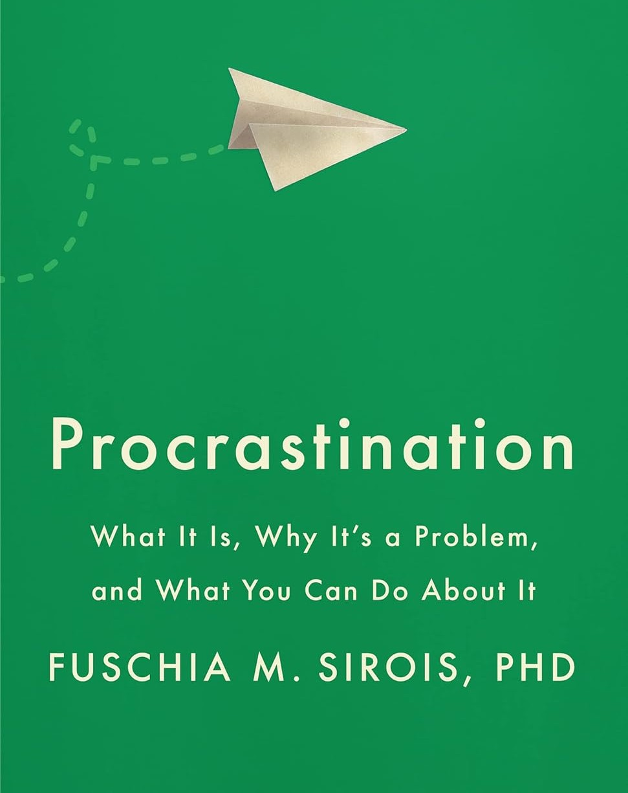
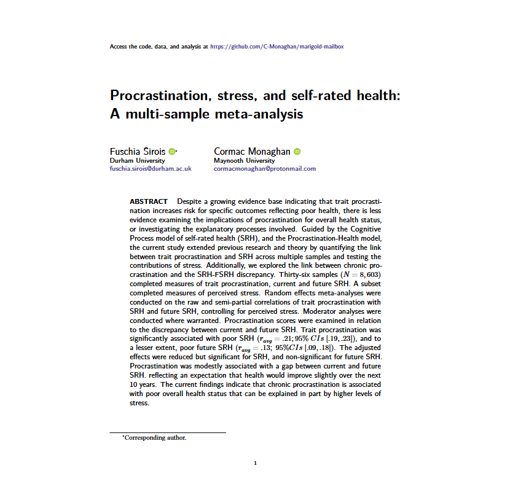
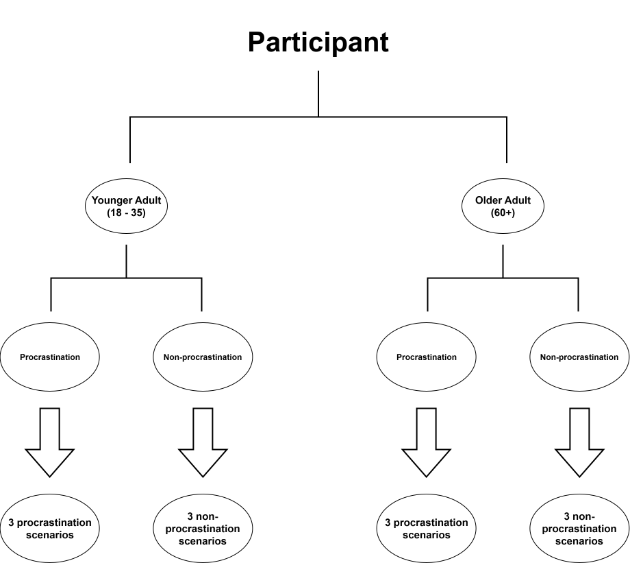

## {transition="slide"}

```{r}
#| label: setup
#| warning: false
#| message: false

# Packages
library(ggplot2)
library(gghalves)
library(ggokabeito)
library(ggsignif)
library(ggbeeswarm)

library(dplyr)

# Theme
# Theme ------------------------------------------------------------------------
theme_clean <- function() {
  theme_minimal() +
    theme(plot.title = element_text(size = 12, face = "bold"),
          plot.subtitle = element_text(size = 10, face = "italic"),
          plot.caption = ggtext::element_markdown(hjust = 0, size = 10),
          axis.title = element_text(size = 10, face = "bold"),
          axis.text.x = element_text(size = 8, face = "bold"),
          axis.text.y = element_text(size = 8),
          strip.text = element_text(face = "bold"),
          panel.grid.minor = element_blank(),
          legend.position = "bottom")
}

# Data files
## Study 1 data
procrastination_norms   <- readRDS(here::here("data/procrastination_norm_data.RDS"))

## Study 2 data files
productivity_data       <- readRDS(here::here("data/productivity_data.RDS"))
adjective_data          <- readRDS(here::here("data/adjective_data.RDS"))
domain_differences_p    <- readRDS(here::here("data/domain_differences_p.RDS"))
domain_differences_a    <- readRDS(here::here("data/domain_differences_a.RDS"))
```

{fig-align="center" width="100%"}

## {transition="slide"}

{fig-align="center" width="100%"}

## {transition="slide"}

{fig-align="center" width="100%"}

## {transition="slide"}

{fig-align="center" width="100%"}

## {transition="slide"}

{fig-align="center" width="100%"}

## {transition="slide" footer=false}

::: {style="text-align:center; font-weight:bold; font-size:40px;"}
{fig-align="center"}
:::

## {transition="slide" footer=false}

::: {layout-ncol=2 layout-valign="center"}
{height="50%"}

{height="50%"}
:::

## {transition="slide"}

:::: {layout-ncol=2 layout-valign="center"}



::::

## {transition="slide"}

<br>

:::: {.fragment .semi-fade-out fragment-index=1}
::: {.callout-note icon="false"}
## Study 1: An experimental test of procrastination and social norms 
:::
::::

<br>

::: {.callout-tip icon="false"}
## Study 2: An experimental test of procrastination and social norms with young and older adults
::: 

<br>

:::: {.fragment .semi-fade-out fragment-index=1}
::: {.callout-warning icon="false"}
## Study 3: An experimental test of procrastination and social norms: The role of perspective
:::
::::

---

## Social norms
### What are social norms

::: {.incremental}
- Shared, often [**unwritten**]{.alert} rules that guide what is seen as [**acceptable and appropriate behaviour**]{.alert} within a group or community.
- Social norms help to maintain [**order and predictability**]{.alert} in social life.
    - Saying "please" or "thank you."
    - Holding the door for someone.
- Violating social norms often provokes [**negative social reactions**]{.alert}.
:::

:::: {.fragment}
::: {.callout-important title="Disapproval" collapse="true"}
:::
::: {.callout-important title="Exclusion" collapse="true"}
:::
::: {.callout-important title="Embarrassment" collapse="true"}
:::
::::

## Social norms
### Procrastination and social norms

::: {.incremental}
- Failing to meet social or task-related expectations can lead others to question one’s [**reliability or worth**]{.alert}.
- Chronic procrastination often clashes with norms of [**responsibility, punctuality, and self-discipline**]{.alert}.
- As a result, procrastinators may be [**socially devalued**]{.alert} [@giguere2016].
:::

:::: {.fragment}
::: {.callout-important title="Lazy" collapse="true"}
:::
::: {.callout-important title="Unreliable" collapse="true"}
:::
::: {.callout-important title="Weak" collapse="true"}
:::
::::

## Social norms
### Procrastination and social norms

::: {.fragment}
```{r}
fig_1 <- procrastination_norms |>
    ggplot(aes(x = abs(y_position), y = mean, fill = condition)) +
    geom_col(position = "dodge", width = 0.8, colour = "black") +
    geom_errorbar(
        aes(ymin = mean - se, ymax = mean + se),
        position = position_dodge(0.8), width = 0.2) +
    scale_fill_okabe_ito() +
    # Primary axis (left) for positive words
    scale_x_continuous(
        breaks = 1:10,
        labels = procrastination_norms |> filter(y_position < 0) |> pull(word) |> unique() |> (\(v) { 
        i1 <- which(v == "High Productivity")
        i2 <- which(v == "Strong")
        v[c(i1, i2)] <- v[c(i2, i1)]
        v
        })(),
        # Secondary axis (right) for negative words
        sec.axis = sec_axis(
        transform  = ~.,
        breaks = 1:10,
        labels = procrastination_norms |> filter(y_position > 0) |> pull(word) |> unique() |> (\(v) { 
            i1 <- which(v == "Low Productivity")
            i2 <- which(v == "Weak")
            v[c(i1, i2)] <- v[c(i2, i1)]
            v
            })()
        )) +
    labs(
        title = "Figure 1",
        subtitle = "Mean self-evaluation scores for the Negative Productivity Index and each adjective pair in the procrastination and non-procrastination condition",
        x = NULL, y = "Self evaluation scores (centered at 0)", 
        fill = NULL) +
    ylim(-3, 3) +
    coord_flip() +
    theme_clean()

fig_1
```

:::

## Social norms
### Age differences in social norms

::: {.incremental}
- How procrastination is judged may vary by age.
- Socioemotional selectivity theory[@carstensen2021] proposes that as people age and perceive their remaining time as limited, they increasingly prioritize [**emotionally meaningful, present-focused goals**]{.alert}.
    - Potentially heighten the perceived cost of delaying important tasks.
- Alternatively, older adults often develop structured routines, pragmatic prioritization strategies, and emotional regulation skills.
    - [**Life experience**]{.alert} may lead to greater acceptance.
:::

:::: {.fragment}
::: {.callout-note appearance="simple"}
## Competing lines of thought
Older adults might judge procrastination more negatively due to limited time horizons, or more leniently due to greater acceptance and coping strategies.
:::
::::

---

{fig-align="center" width="100%"}

---

<br>

```{r}
fig_1
```

---

## Age differences in social norms
### Research plan

::: {.incremental}
- Recruited 200 participants (100 younger & 100 older adults).
- Used [Prolific](https://www.prolific.com/) to collect data.
- Presented [**multiple**]{.alert} procrastination / non-procrastination scenarios.
  - General procrastination
  - Health procrastination
  - Financial procrastination
- Analysed data using a [**multilevel model**]{.alert}.
:::

::: {.fragment .fade-up}
$$
\underbrace{\mathbf{y}}_{n \times 1}
= 
\underbrace{\mathbf{X \quad \beta}}_{n\times p \; p \times 1} 
\; + \;
\underbrace{\mathbf{Z}}_{n \times N}\; \underbrace{\mathbf{u}}_{N \times 1} 
\;+\;
\underbrace{\mathbf{\varepsilon}}_{n \times 1}, \qquad
\mathbf{u} \sim \mathcal{N}(\mathbf{0},\, \sigma_u^2 \; \mathbf{I}_N), \;
\mathbf{\varepsilon} \sim \mathcal{N}(\mathbf{0},\, \sigma^2 \; \mathbf{I}_n)
$$

:::

## Age differences in social norms
### Multilevel models

A standard regression model typically assumes one common intercept and slope for every observation

$$ 
y_i = \beta_0 + \beta_1x_i + \epsilon_i \qquad \epsilon_i \sim N(0, \sigma^2_e)
$$


```{r}
#| fig-align: center
#| 
set.seed(123)

x <- rnorm(n = 100, mean = 2, sd = 3)
y <- 3 + x + runif(n = 100, min = 0, max = 0.5)

data <- tibble::tibble(y = y, x = x)

fig_2 <- data |>
    ggplot(aes(x = x, y = y)) +
    geom_point(size = 0.5) +
    geom_smooth(
        se = FALSE, 
        linewidth = 2, 
        colour = palette_okabe_ito(order = 1)) +
    labs(subtitle = "Single intercept", x = "X variable", y = "Y variable") +
    theme_clean()

fig_2
```

---

## Age differences in social norms
### Multilevel models

Allow the intercept to vary across groups (e.g. participants). Index responses by $i$ (response) and  $j$ (participant):

$$
y_{ij} = \beta_{0j} + \beta_{1}x_{ij} + \epsilon_{ij} \qquad \epsilon \sim N(0, \sigma^2_e)
$$

::: {.fragment}
Model the varying intercept as:

$$
\beta_{0j} = \gamma_{00} + \mu_{0j} \qquad \mu_{0j} \sim N(0, \tau_{00})
$$

:::

::: {.fragment}
Substituting everything back in:

$$
y_{ij} = \gamma_{00} + \beta_{1}x_{ij} + \mu_{0j} + \epsilon_{ij}
$$

:::

---

<br>

```{r}
#| fig-align: center
#| fig-width: 10

set.seed(123)

# Simulate data for 6 participants (j), each with 20 observations (i)
n_participants <- 6
n_obs          <- 20

participants <- factor(rep(1:n_participants, each = n_obs))

# Random intercepts per participant (normally distributed around 3)
intercepts <- rnorm(n_participants, mean = 3, sd = 1)

# Fixed slope (shared across participants)
slope <- 1.2

# Predictor and outcome
x <- rnorm(n_participants * n_obs, mean = 2, sd = 2)
y <- intercepts[participants] + slope * x + rnorm(length(x), 0, 0.5)

data_ml <- tibble::tibble(
  participant = participants,
  x = x,
  y = y
)

fig_3 <- data_ml |>
    ggplot(aes(x = x, y = y, colour = participant)) +
    geom_point(size = 1, alpha = 0.7) +
    geom_smooth(method = "lm", se = FALSE, linewidth = 1.2) +
    scale_color_okabe_ito() +
    labs(
        subtitle = "Multiple intercepts", 
        x = "X variable", y = "Y variable", colour = "Participant") +
    guides(colour = "none") +
    theme_clean()

patchwork::wrap_plots(fig_2, fig_3, axis_titles = "collect")
```

## Age differences in social norms
### Research questions

This project was pre-registered on the Open Science Framework: [https://osf.io/kjybe](https://osf.io/kjybe)

While we had many research questions, our [**primary questions**]{.alert} were:

::: {.fragment}
- Examining whether the social norms for general vs. health vs. financial procrastination differ, both within individuals, and compared to a control group.
- Examining whether negative social norms associated with procrastination differ between age cohorts (younger vs older adults).
:::

---

<br>

```{r}
#| fig-align: center

productivity_data |>
  group_by(scenario, domain, age_group) |>
  summarise(p_index = mean(p_index)) |>
  ggplot(aes(x = scenario, y = p_index, fill = domain)) +
  geom_col(position = "dodge", colour = "black") +
  scale_fill_okabe_ito() +
  labs(
    title = "Figure 2", 
    subtitle = "Mean Negative Productivity Index scores", 
    x = NULL, y = "Negative Productivity Index", fill = NULL) +
  facet_grid(~age_group, labeller = labeller(age_group = function(x) paste0(x, " Adult"))) +
  theme_clean()
```

---

```{r}
#| fig-align: center
#| fig-height: 6
#| 
adjective_data |>
  group_by(scenario, domain, age_group, adjective) |>
  summarise(rating = mean(rating)) |>
  ggplot(aes(x = scenario, y = rating, fill = domain)) +
  geom_col(position = "dodge", colour = "black") +
  scale_fill_okabe_ito() +
  labs(
    title = "Figure 3", subtitle = "Mean adjective rating",
    x = NULL, y = "Adjective Rating", fill = NULL) +
  facet_grid(age_group ~ adjective, labeller = labeller(
    age_group = function(x) paste0(x, " Adult"))) +
  theme_clean()
```

# **Multilevel model results** {background-color="#40666e" footer=false}

---

<br>

```{r}
#| fig-align: center

productivity_data |>
  ggplot(aes(x = scenario, y = p_index, fill = scenario, colour = scenario)) +
  geom_half_point(transformation = position_quasirandom(width = 0.1), side = "l") +
  geom_half_boxplot(side = "r", colour = "black") +
  geom_signif(
    comparisons = list(c("Non-Procrastination", "Procrastination")),
    annotations = "β = 3.27, p < 0.001",
    size = 0.75, textsize = 4, margin_top = 0.05,
    tip_length = 0.04, vjust = 0.01, colour = "black") +
  # Plot customization
  scale_y_continuous(breaks = seq(2, 7, by = 1), expand = expansion(add = 0.75)) +
  scale_color_okabe_ito() + scale_fill_okabe_ito() +
  labs(
    title = "Figure 4", subtitle = "Neagive productivity index scores by scenario", 
    x = NULL, y = "Negative productivity index") + 
  guides(colour = "none", fill = "none") +
  theme_clean()
```

---

<br>

```{r}
#| fig-align: center
#| 
productivity_data |>
  dplyr::filter(scenario == "Procrastination") |>
  ggplot(aes(x = age_group, y = p_index, colour = age_group, fill = age_group)) +
  gghalves::geom_half_point(transformation = ggbeeswarm::position_quasirandom(width = 0.1), side = "l") +
  gghalves::geom_half_boxplot(side = "r", colour = "black") +
  ggokabeito::scale_color_okabe_ito() + ggokabeito::scale_fill_okabe_ito() +
  ggsignif::geom_signif(
    comparisons = list(c("Younger", "Older")),
    annotations = "β = 0.34, p = 0.089",
    size = 0.75, textsize = 4, margin_top = 0.1,
    tip_length = 0.04, vjust = 0.01, colour = "black"
  ) +
  scale_y_continuous(breaks = seq(2, 7, by = 1), expand = expansion(add = 0.75)) +
  labs(
    title = "Figure 5",
    subtitle = "Age differences in negative productivity scores",
    x = NULL, y = "Negative Productivity Index") +
  facet_wrap(~scenario, labeller = labeller(scenario = function(x) paste0(x, " Scenario"))) +
  guides(colour = "none", fill = "none") +
  theme_clean()

```

---

<br>

```{r}
#| fig-align: center
#| 
domain_differences_p |>
    ggplot(aes(
        x = estimate, y = contrast, colour = highlight, 
        linetype = scenario, group = scenario)) +
  geom_vline(xintercept = 0, colour = "grey50", linetype = "dashed") +
  geom_point(position = ggstance::position_dodgev(height = 0.75), size = 3) +
  ggstance::geom_errorbarh(
    aes(xmin = ci_lower, xmax = ci_upper),
    position = ggstance::position_dodgev(height = 0.75), size = 0.75) +
  scale_colour_manual(values = c(
    "NS" = "#999999", "Procrastination" = "#56B4E9", "Non-Procrastination" = "#E69F00"),
    limits = c("Non-Procrastination", "Procrastination")) +
  scale_linetype_manual(values = c(
    "Non-Procrastination" = "dashed", "Procrastination" = "solid"
  )) +
  labs(
    title = "Figure 6a",
    subtitle = "Pairwise domain contrasts by scenario",
    x = "Estimated difference in Negative Productivity Index", y = "Domain contrast",
    colour = NULL, linetype = NULL) +
  theme_clean()
```

---

<br>

```{r}
#| fig-align: center
#| fig-height: 6

productivity_data |>
  group_by(scenario, domain) |>
  summarise(p_index = mean(p_index)) |>
  ggplot(aes(x = domain, y = p_index, colour = scenario, group = scenario)) +
  geom_point(size = 3) +
  geom_line(linewidth = 1) +
  ggtext::geom_richtext(
    aes(
      y = case_when(
        scenario == "Procrastination" ~ p_index - 0.5,
        scenario == "Non-Procrastination" & domain != "Health" ~ p_index + 0.6,
        TRUE ~ p_index + 0.5), 
      label = sprintf("μ = %.2f", p_index)), show.legend = FALSE) +
  scale_x_discrete(label = function(x) paste0(x, " \nProcrastination")) +
  ggokabeito::scale_colour_okabe_ito() +
  labs(
    title = "Figure 6b", subtitle = "Mean Negative Productivity Index scores",
    x = NULL, y = "Mean negative productivity index", colour = NULL) + 
  guides(label = "none") +
  theme_clean()
```

---

<br>

```{r}
#| fig-align: center
#| fig-width: 10
#| fig-height: 6
#| 
domain_differences_a |>
  ggplot(aes(
    x = estimate, y = contrast, colour = highlight, 
    linetype = scenario, group = scenario)) +
  geom_vline(xintercept = 0, colour = "grey50", linetype = "dashed") +
  geom_point(position = ggstance::position_dodgev(height = 0.75), size = 3) +
  ggstance::geom_errorbarh(
    aes(xmin = ci_lower, xmax = ci_upper),
    position = ggstance::position_dodgev(height = 0.75), size = 0.75) +
  scale_colour_manual(values = c(
    "NS" = "#999999", "Procrastination" = "#56B4E9", "Non-Procrastination" = "#E69F00"),
    limits = c("Non-Procrastination", "Procrastination")) +
  scale_linetype_manual(values = c(
    "Non-Procrastination" = "dashed", "Procrastination" = "solid")) +
  labs(
    title = "Figure 7",
    subtitle = "Pairwise domain contrasts by scenario and age group",
    x = "Estimated difference in adjective ratings", y = "Domain contrast",
    colour = NULL, linetype = NULL) +
  facet_grid(age_group ~ adjective, labeller = labeller(
    age_group = c("Younger" = "Younger Adult (18 - 30)", "Older" = "Older Adult (60+)")
  )) +
  theme_clean() +
  theme(panel.border = element_rect(
    fill = "transparent",
    color = "black", linewidth = 1.5))
```

## Age differences in social norms {footer=false}
### Conclusions

::: {.fragment}
[**Productivity**]{.alert}

- Health procrastination is perceived as more negatively productive than general procrastination.
- However, financial procrastination is perceived as more negatively productive than both general or health procrastination.
:::

::: {.fragment}
[**Adjective Ratings**]{.alert}

- Both younger and older adults perceive financial procrastination as more shameful than general procrastination.
- Younger adults perceive both health and financial procrastination as more present oriented than general procrastination.
:::

## References

::: {#refs}
:::

---

<br>

```{r}
#| fig-align: center

fig_1
```
